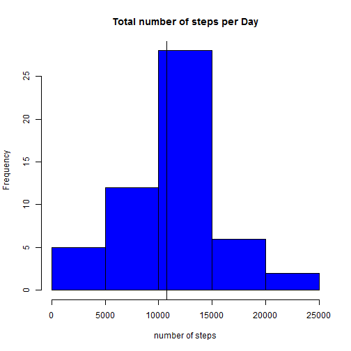
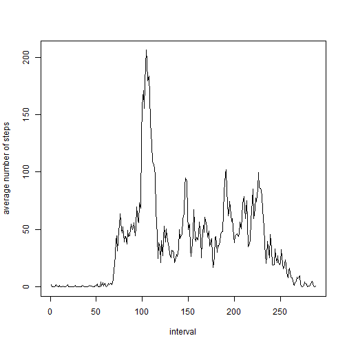
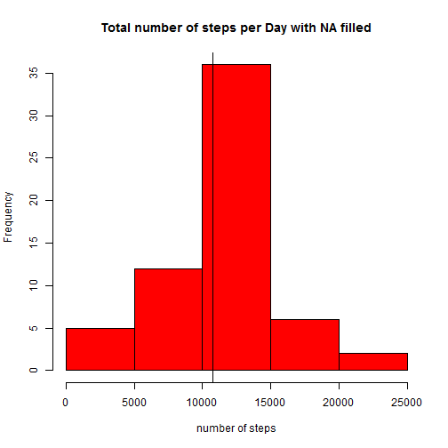
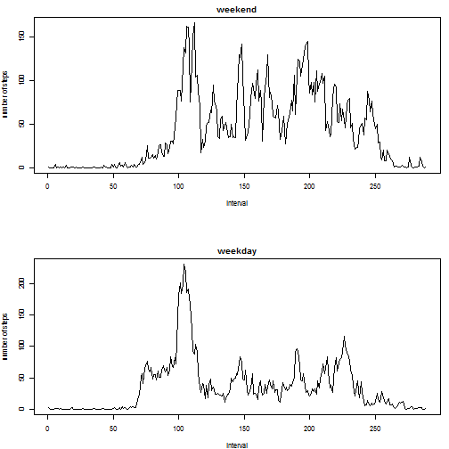

##Introduction

It is now possible to collect a large amount of data about personal movement using activity monitoring devices such as a Fitbit, Nike Fuelband, or Jawbone Up. These type of devices are part of the "quantified self" movement - a group of enthusiasts who take measurements about themselves regularly to improve their health, to find patterns in their behavior, or because they are tech geeks. But these data remain under-utilized both because the raw data are hard to obtain and there is a lack of statistical methods and software for processing and interpreting the data.

This assignment makes use of data from a personal activity monitoring device. This device collects data at 5 minute intervals through out the day. The data consists of two months of data from an anonymous individual collected during the months of October and November, 2012 and include the number of steps taken in 5 minute intervals each day.

##Data

The data for this assignment can be downloaded from the course web site:

Dataset: [Activity monitoring data](https://d396qusza40orc.cloudfront.net/repdata%2Fdata%2Factivity.zip) [52K]
The variables included in this dataset are:

- steps: Number of steps taking in a 5-minute interval (missing values are coded as NA)

- date: The date on which the measurement was taken in YYYY-MM-DD format

- interval: Identifier for the 5-minute interval in which measurement was taken

The dataset is stored in a comma-separated-value (CSV) file and there are a total of 17,568 observations in this dataset.

##Assignment

This assignment will be described in multiple parts. You will need to write a report that answers the questions detailed below. Ultimately, you will need to complete the entire assignment in a single R markdown document that can be processed by knitr and be transformed into an HTML file.

Throughout your report make sure you always include the code that you used to generate the output you present. When writing code chunks in the R markdown document, always use echo = TRUE so that someone else will be able to read the code. **This assignment will be evaluated via peer assessment so it is essential that your peer evaluators be able to review the code for your analysis.**

For the plotting aspects of this assignment, feel free to use any plotting system in R (i.e., base, lattice, ggplot2)

Fork/clone the [GitHub repository created for this assignment](http://github.com/rdpeng/RepData_PeerAssessment1). You will submit this assignment by pushing your completed files into your forked repository on GitHub. The assignment submission will consist of the URL to your GitHub repository and the SHA-1 commit ID for your repository state.

NOTE: The GitHub repository also contains the dataset for the assignment so you do not have to download the data separately.

***

## Loading and preprocessing the data

1.Load the data (i.e. read.csv())

Make a directory named 'data' if not already exists.

```r
if (!file.exists("data")) {
        dir.create("data")
}
```

If not already exists, download the data zip file, unzip, and read it.

```r
fileUrl <- "https://d396qusza40orc.cloudfront.net/repdata%2Fdata%2Factivity.zip"
setInternet2(use = TRUE)
if (!file.exists("./data/repdata_data_Factivity.zip")){
  download.file(fileUrl, destfile = "./data/repdata_data_Factivity.zip")
  dateDownloaded <- date()
}
dat <- read.csv(unz("./data/repdata_data_Factivity.zip", "activity.csv"))
```

2.Process/transform the data (if necessary) into a format suitable for your analysis

While examining the interval column, I see that there are some oddity in interval column.

```r
dat[10:15,]
```

```
##    steps       date interval
## 10    NA 2012-10-01       45
## 11    NA 2012-10-01       50
## 12    NA 2012-10-01       55
## 13    NA 2012-10-01      100
## 14    NA 2012-10-01      105
## 15    NA 2012-10-01      110
```
Look at 12th and 13th row of 'interval' column. Right after 55, the value of 'interval' column becomes 100. This could be problematic since we want to make time series plot later. It would make more sense if after 55, value of 'interval' becomes 60, 65, and so on.

**Note that there could be multiple ways to interpret and implement transformation of 'interval' column. I choose to think 0 as 'interval' between 0 and 5 minutes of the day, 5 as 'interval' between 5 and 10 minutes of the day, and so on.**

```r
dat$interval <- ifelse(dat$interval > 60, floor(dat$interval/100) * 60 + dat$interval %% 100, dat$interval)
dat[10:15,]
```

```
##    steps       date interval
## 10    NA 2012-10-01       45
## 11    NA 2012-10-01       50
## 12    NA 2012-10-01       55
## 13    NA 2012-10-01       60
## 14    NA 2012-10-01       65
## 15    NA 2012-10-01       70
```
Problem fixed. Now we see that after 55, the value of 'interval' column increases to 60, 65, and so on.

***
## What is mean total number of steps taken per day?

For this part of the assignment, you can **ignore the missing values** in the dataset.

1.Make a histogram of the total number of steps taken each day


```r
datNoMissing <- na.omit(dat)    # create new dataset without missing data 

datStepsDaily <- tapply(datNoMissing$steps, datNoMissing$date, sum)

hist(datStepsDaily, main = "Total number of steps per Day", xlab ="number of steps", col ="blue")
abline(v = mean(datStepsDaily, na.rm = T), lwd = 1)
abline(v = median(datStepsDaily, na.rm = T), lwd = 1)
```

 

2.Calculate and report the mean and median total number of steps taken per day

```r
mean(datStepsDaily, na.rm = T)
```

```
## [1] 10766.19
```

```r
median(datStepsDaily, na.rm = T)
```

```
## [1] 10765
```

> The mean and median total number of steps taken per day are 10766.19 and 10765, respectively. Two vertical lines in histogram represent mean and median.(they are close to each other, so it looks like one line).

***

## What is the average daily activity pattern?

1.Make a time series plot (i.e. type = "l") of the 5-minute interval (x-axis) and the average number of steps taken, averaged across all days (y-axis)

```r
datIntervalAvgSteps <- tapply(datNoMissing$steps, datNoMissing$interval, mean)
plot(datIntervalAvgSteps, type = 'l', xlab = "interval", ylab = "average number of steps")
```

 

2.Which 5-minute interval, on average across all the days in the dataset, contains the maximum number of steps?

```r
max(datIntervalAvgSteps)
```

```
## [1] 206.1698
```

```r
which(datIntervalAvgSteps == max(datIntervalAvgSteps))
```

```
## 515 
## 104
```

```r
which.max(datIntervalAvgSteps)
```

```
## 515 
## 104
```

> 104th element of the array, that has interval 515, which can be interpreted as interval between 515 ~ 520 minutes of a day. In other words, **8:35AM ~ 8:40AM** , had maximum number of steps, about 206 steps.

***
## Imputing missing values

Note that there are a number of days/intervals where there are missing values (coded as NA). The presence of missing days may introduce bias into some calculations or summaries of the data.

1.Calculate and report the total number of missing values in the dataset (i.e. the total number of rows with NAs)

First method is subtracting the number of rows of 'datNoMissing' from those of 'dat'

```r
nrow(dat) - nrow(datNoMissing)
```

```
## [1] 2304
```
**OR**
Alternative is to check how many missing values are in the dataset.

```r
table(is.na(dat$steps))
```

```
## 
## FALSE  TRUE 
## 15264  2304
```

```r
table(is.na(dat$date))
```

```
## 
## FALSE 
## 17568
```

```r
table(is.na(dat$interval))
```

```
## 
## FALSE 
## 17568
```

> Both method indicates that there are 2304 missing values in the dataset. The second method shows that all of the NAs are from steps column.

2.Devise a strategy for filling in all of the missing values in the dataset. The strategy does not need to be sophisticated. For example, you could use the mean/median for that day, or the mean for that 5-minute interval, etc.

It seems reasonalble to assume there are certain patterns in number of steps taken during each intervals. Therefore, let us use the mean steps for that 5-minute interval to fill in missing values.

```r
stepsFilled <- ifelse(is.na(dat$steps), datIntervalAvgSteps[as.character(dat$interval)], dat$steps)
```
I filled in all missing values from 'steps' column to new vector called 'stepsFilled.' 


3.Create a new dataset that is equal to the original dataset but with the missing data filled in.

Make a copy of original data frame 'dat' called 'datFilled.' Then fill steps column of 'datFilled' with 'stepsFilled' a vector with NAs filled in.

```r
datFilled <- dat  #copy of original data.
datFilled$steps <- stepsFilled   #fill in NAs.
```


4.Make a histogram of the total number of steps taken each day and Calculate and report the mean and median total number of steps taken per day. Do these values differ from the estimates from the first part of the assignment? What is the impact of imputing missing data on the estimates of the total daily number of steps?

```r
datFilledStepsDaily <- tapply(datFilled$steps, datFilled$date, sum)
hist(datFilledStepsDaily, main = "Total number of steps per Day with NA filled", xlab = "number of steps", col="red")
abline(v = mean(datFilledStepsDaily), lwd = 1)
abline(v = median(datFilledStepsDaily), lwd = 1)
```

 


```r
mean(datFilledStepsDaily)
```

```
## [1] 10766.19
```

```r
median(datFilledStepsDaily)
```

```
## [1] 10766.19
```

> The mean and the median total number of steps taken per day are 10766.19. The impact of imputing missing data is very small. The mean stayed same and the median merely increased by 1.19. Two vertical lines in histogram represent the mean and the median.(they are same, so it is just one line)

## Are there differences in activity patterns between weekdays and weekends?

For this part the `weekdays()` function may be of some help here. Use the dataset with the filled-in missing values for this part.

1. Create a new factor variable in the dataset with two levels - "weekday" and "weekend" indicating whether a given date is a weekday or weekend day.


```r
datFilled$weekdays <- weekdays(as.Date(datFilled$date))
is.weekend <- (datFilled$weekdays == "Saturday" | datFilled$weekdays == "Sunday")
datFilled$day_factor <- as.factor(ifelse(is.weekend, "weekend", "weekday"))
```

Let's check days are correctly categorized.

```r
table(datFilled$day_factor, datFilled$weekdays)
```

```
##          
##           Friday Monday Saturday Sunday Thursday Tuesday Wednesday
##   weekday   2592   2592        0      0     2592    2592      2592
##   weekend      0      0     2304   2304        0       0         0
```
Good. Saturdays and Sundays are categorized as weekend, and rest are as weekday.

2. Make a panel plot containing a time series plot (i.e. type = "l") of the 5-minute interval (x-axis) and the average number of steps taken, averaged across all weekday days or weekend days (y-axis). See the README file in the GitHub repository to see an example of what this plot should look like using simulated data.


```r
m <- rbind(c(1,1), c(1,1), c(1,1), c(1,1), c(1,1), c(1,1), c(3,3), c(2,2),c(2,2),c(2,2), c(2,2),c(2,2),c(2,2))
layout(m)
par(mar = c(4, 4, 2, 1))

subsetFilledWeekend<- subset(datFilled, day_factor == "weekend")
datIntervalAvgStepsWeekend <- tapply(subsetFilledWeekend$steps, subsetFilledWeekend$interval, mean)
plot(datIntervalAvgStepsWeekend, type = 'l', main = "weekend", xlab = "interval", ylab = "number of steps")

subsetFilledWeekday<- subset(datFilled, day_factor == "weekday")
datIntervalAvgStepsWeekday <- tapply(subsetFilledWeekday$steps, subsetFilledWeekday$interval, mean)
plot(datIntervalAvgStepsWeekday, type = 'l', main = "weekday", xlab = "interval", ylab = "number of steps")

rm(m)
```

 

> There are, it seems, differences in activity patterns between weekdays and weekends. Looking at the plot, during weekend, average number of steps seems higher in general.


```r
summary(datIntervalAvgStepsWeekend)
```

```
##    Min. 1st Qu.  Median    Mean 3rd Qu.    Max. 
##   0.000   1.241  32.340  42.370  74.650 166.600
```

```r
summary(datIntervalAvgStepsWeekday)
```

```
##    Min. 1st Qu.  Median    Mean 3rd Qu.    Max. 
##   0.000   2.247  25.800  35.610  50.850 230.400
```

> Indeed, during weekend, mean and median average steps are higher. I guess during weekdays people have to work sitted, and during weekend people enjoy outside.
